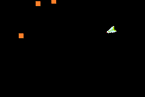

# Bullet Purgatory GBA

A small game prototype for the Game Boy Advance. Player controls a ship that moves in a circle and tries to shoot targets. Tested and confirmed to work on real Nintendo hardware!

Only a tiny bit implemented so far. No collision between bullets and targets yet.

